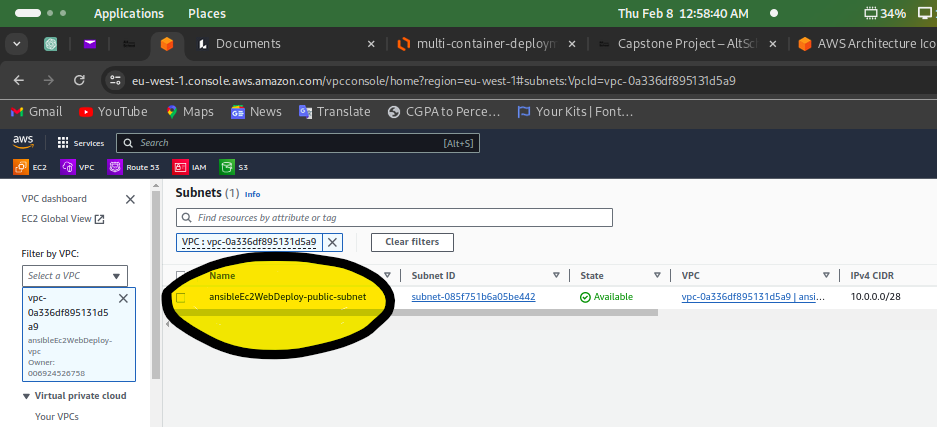

# ANSIBLE EC2 WEB DEPLOY DOCUMENTATION

## Table of Contents

1. [Introduction](#1-introduction)
2. [Prerequisites](#2-prerequisites)
3. [Planning](#3-planning)
4. [Architecture](#4-architecture)
5. [Key Features](#5-key-features)
6. [Running the Project](#6-running-the-project)
7. [Testing](#7-testing)
8. [Contributions](#8-contributions)
9. [References](#9-references)
10. [Conclusion](#10-conclusion)

## 1. Introduction

Ansible EC2 Web Deploy is a simple project to deploy an Apache web server on an EC2 instance using Ansible. The project consists of numerous roles to set up the EC2 instance and install the Apache web server on AWS. A security group is created to allow SSH and HTTP traffic to the EC2 instance. The EC2 instance has its own VPC in the eu-west-1 region. The latest Amazon Linux 2 AMI is used for the EC2 instance. The instance type is t2.micro. The project was written and tested on a Fedora 39 workstation. The aim of the project is to demonstrate how to use Ansible to deploy infrastructure on AWS. The project places strong focus on security and best practices. Error handling, tagging, security, and idempotency are also key features of the project.

## 2. Prerequisites

The following prerequisites are required to run the project:

- A Linux workstation (it can be any Linux distribution, but the project was written and tested on Fedora 39)
- AWS account with access to the AWS Management Console
- AWS CLI installed and configured
- Latest Ansible installed
- Python 3.8 or later installed
- Boto3 installed

## 3. Planning

The project consists of the following components:

- Ansible playbooks
- Ansible roles
- Ansible configuration file

The Ansible playbooks are used to deploy the infrastructure on AWS. The roles are used to set up the infrastructure and install the Apache web server on the EC2 instance. The Ansible configuration file is used to configure the AWS connection settings.

## 4. Architecture

The architecture of the project is as follows:

- A VPC and all its components (subnets, route tables, internet gateways, security groups, etc.) are created using Ansible roles
- A Key Pair is created using Ansible roles, and the private key is saved to the local workstation
- A Security Group is created to allow SSH and HTTP traffic to the EC2 instance
- An EC2 instance is created using Ansible roles
- The Apache web server is installed on the EC2 instance using Ansible roles


## 5. Key Features

The project is written in Ansible and uses roles to deploy the infrastructure on AWS. The roles are idempotent and can be run multiple times without causing any issues, even if the infrastructure is already deployed. The roles are also written to be secure and follow best practices.

The key features of the project are as follows:

- Readable and maintainable code: The code is well-documented and easy to understand. The roles are modular and can be reused in other projects.

- Reusability: Variables are used to store values that can be reused in other projects. Certain variables that are retrieved from the AWS Management Console are updated automatically using the `lineinfile` module. The modules are used to update the `vars/main.yml` file every time the project is run.

  The `lineinfile` module is used to replace a specific line in a file with a new line or add a new line if it is not present. The `lineinfile` module was used to update the `instance_id`, `vpc_id`, and `public_route_table_id` variables in the `vars/main.yml` file. The `instance_id`, `vpc_id`, and `public_route_table_id` variables are used in the destroy roles to delete the EC2 instance, VPC, and public route table, respectively.

- Error handling: The project has error handling built-in. The `block` and `rescue` modules are used to catch errors and display a message to the user if an error occurs. The `ignore_errors` module is used to ignore errors and continue running the playbook. The conditional `when` statement is used to check if certain conditions are met before running a task. All these are to ensure that each task is successfully executed before the next, and when they fail, a clear error message is displayed to the user.

- Security: Precautions were taken to prevent the breach of security. The `--ask-vault-pass` option is used to specify the vault password file when running the playbook. `Ansible-vault` was used to encrypt the AWS credentials in the `vars/aws_credentials.yml` file. The `--tags` option is used to specify which tags to run when running the playbook. The `--check` option is used to perform a dry run of the playbook.

  ```bash
  ansible-playbook create.yml --ask-vault-pass
  ```

  The `--ask-vault-pass` option is used to specify the vault password file when running the playbook.

  ```bash
  ansible-vault encrypt vars/aws_credentials.yml
  ```

  The `ansible-vault` command is used to encrypt the `aws_credentials.yml` file.

  ```bash
  ansible-playbook create.yml --tags "vpc"
  ```

  The `--tags` option is used to specify which tags to run when running the playbook. This command will only run the `vpc` tag.

  ```bash
  ansible-playbook create.yml --check
  ```

  The `--check` option is used to perform a dry run of the playbook. This command will not make any changes to the infrastructure but will show what changes would be made if the playbook were run. NOTE: The output of this command for this project may give a lot of errors because a lot of tasks within the roles are dependent on the output of the previous tasks, which are not present when the `--check` option is used.

- `destroy.yml`: The `destroy.yml` playbook is used to delete the infrastructure on AWS. The `destroy.yml` playbook is idempotent and can be run multiple times without causing any issues, even if the infrastructure is already deleted. The `destroy.yml` playbook is also written to be secure and follow best practices. This was done because in Ansible, there is no command to destroy the infrastructure that was created using the `create.yml` playbook, unlike in Terraform, where the `terraform destroy` command is used to destroy the infrastructure that was created using the `terraform apply` command.

- Dynamic Tagging: All the resources created in each role are tagged with the `Name` tags. This is to ensure that the resources are easily identifiable in the AWS Management Console.

## 6. Running the Project

To run the project, this command was used:

```bash
ansible-playbook create.yml --ask-vault-pass
```

The screenshot below shows the output of the command:


To delete the infrastructure, this command was used:

```bash
ansible-playbook destroy.yml --ask-vault-pass
```

The screenshot below shows the output of the command:


## 7. Testing

I checked the AWS Management Console to confirm that the infrastructure was created.

The screenshots below show all the resources created in the AWS Management Console:





The IP address of the EC2 instance was copied and pasted into the web browser, and the Apache web server default page was displayed. The screenshot below shows the output of this action:


## 8. Contributions

Contributions are welcome. If you find any issues with the project, please open an issue on GitHub. If you would like to contribute to the project, please fork the repository, make your changes, and submit a pull request.

## 9. References

- [Ansible Documentation](https://docs.ansible.com/ansible/latest/index.html)
- [AWS Documentation](https://docs.aws.amazon.com/index.html)
- [Boto3 Documentation](https://boto3.amazonaws.com/v1/documentation/api/latest/index.html)
- [Python Documentation](https://docs.python.org/3/index.html)

## 10. Conclusion

The project was successful. The infrastructure was created on AWS, and the Apache web server was installed on the EC2 instance. The project was written to be secure and follow best practices. The project was also written to be idempotent and can be run multiple times without causing any issues, even if the infrastructure is already deployed. The project was written and tested on a Fedora 39 workstation. The project was written to demonstrate how to use Ansible to deploy infrastructure on AWS. The project placed strong focus on security and best practices. Error handling, and tagging are also key features of the project.
